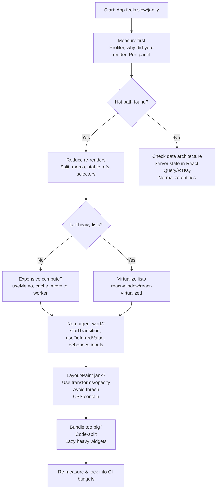

# Deep React Trees — Performance Cheat Sheet

Use this as a quick checklist when things feel slow or janky.

## 1) Measure before changing
- React Profiler flamegraph to find hot components
- Add `why-did-you-render` in dev to catch accidental re-renders
- Browser Performance panel for layout/paint costs

## 2) Reduce re-renders
- Split large components; prefer small leaves
- Use **selector-based reads** (Redux/Zustand selectors, `use-context-selector`)
- Stabilize references: hoist constants, `useMemo`, `useCallback` (only when props cross boundaries)
- Memoize leaves with `React.memo`

## 3) Keep render cost low
- **Virtualize** big lists (`react-window`, `react-virtualized`)
- Cache heavy computations with `useMemo` or selectors
- Code-split and lazy-load deep subtrees, wrap with **Suspense**

## 4) Prioritize UX with React 18+
- Mark non-urgent updates with **`startTransition`**
- Smooth type-ahead/filters with **`useDeferredValue`**
- Use Suspense boundaries to prevent whole-tree blocking

## 5) Data architecture
- Keep **server state** in TanStack Query / RTK Query for cache/dedupe/background refresh
- Normalize entities and read through memoized selectors
- Pick stores with fine-grained subscriptions (Redux selectors, Zustand/Jotai)

## 6) Layout & paint hygiene
- Prefer **transform/opacity** over layout-changing properties
- Avoid read-after-write layout thrash inside a tick
- Use `contain` CSS on isolated widgets to scope reflow

## 7) Guardrails & budgets
- ESLint rules-of-hooks & exhaustive-deps
- Bundle budgets; analyze and split by route/feature
- Automate perf checks in CI (LCP/TTI, bundle size)

---

## Quick fixes by symptom
- **Typing lag in big lists** → Virtualize + `useDeferredValue` + memoized row
- **One change re-renders half the app** → Split contexts; selector-based reads; `React.memo`
- **Network chatter on every keystroke** → Debounce inputs; rely on query caching/deduping
- **Animation jank** → Use transforms; isolate with CSS `contain`

---

## Visual Cheat Sheet

