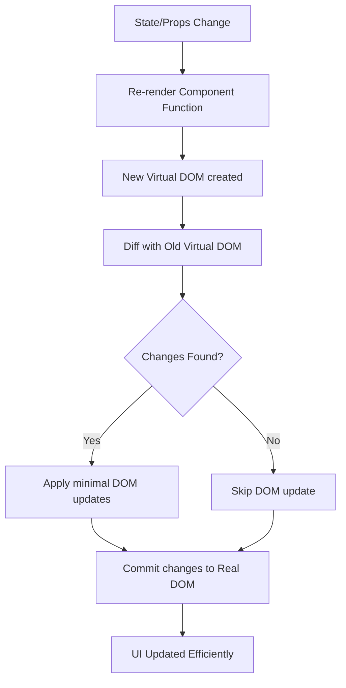

# DOM, Virtual DOM, and React Updates — In a Nutshell

---

## What is the DOM?
- **DOM (Document Object Model)**: A programming interface that represents an HTML or XML document as a **tree structure**.
- Each HTML element (like `<div>`, `<button>`) is a **node** in this tree.
- JavaScript can **read, add, update, or delete** nodes in the DOM to change the page dynamically.
- Example:
  ```html
  <div id="app">
    <h1>Hello</h1>
    <button>Click</button>
  </div>
  ```
  The above becomes a tree with `div` as parent → children: `h1`, `button`.

---

## What is the Virtual DOM?
- The **Virtual DOM (VDOM)** is a **lightweight copy** of the real DOM kept in memory by React.
- Instead of changing the real DOM directly (which is **slow**), React:
  1. Updates the virtual DOM.
  2. Compares it with the previous version (called **diffing**).
  3. Applies only the **minimal changes** to the real DOM (called **reconciliation**).
- This reduces performance costs since the real DOM is expensive to manipulate.

---

## How React Updates the DOM


---

## When Does React Update the DOM?
React updates the real DOM **only when necessary**:

1. **State changes** (`useState`, `useReducer`)  
   - Example: A counter button increments its displayed number.
2. **Props changes** (data passed from parent component).  
   - Example: Parent sends new data to child → child re-renders.
3. **Context changes** (if the component consumes a context that updated).  
   - Example: Theme context changes from "light" → "dark".
4. **Force re-render** (`key` change or `forceUpdate` in class components).  

**Important:**  
- React will **not** update the DOM if the new Virtual DOM tree matches the old one (no real change).  
- This makes React efficient — it avoids unnecessary DOM writes.

---

## Mental Model Summary
- **DOM** = Real page tree → slow to update often.  
- **Virtual DOM** = In-memory copy React controls.  
- **React update flow** = state/props/context change → VDOM diff → minimal real DOM update.  
- **Scenario for updates** = Only when there is an actual change between old VDOM and new VDOM.

---
